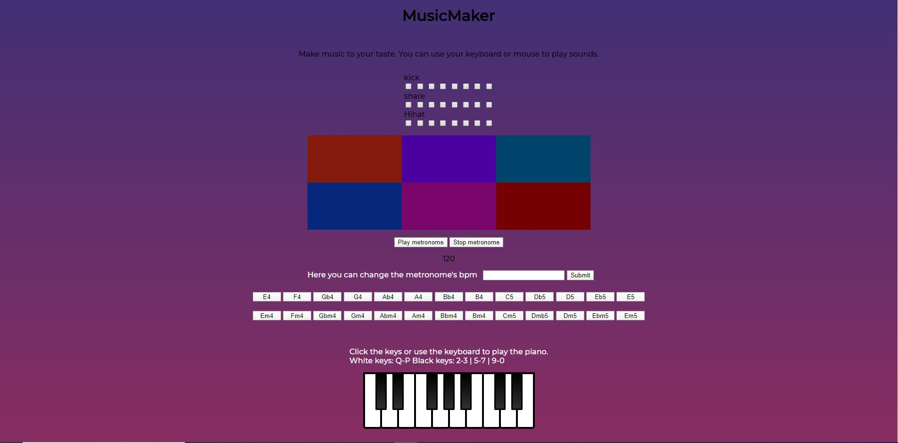

# MusicMaker

Autor: Henry Pajuri

Tegemist on programmiga, millega on võimalik muusikat teha. Iga heli tekitamiseks on võimalik, kas kasutada hiirt või klaviatuuri.

1. Ekraani üleval on kolm 8 kastist rida(kick, snare, Hihat), iga kast, millel on linnuke tekitab vastaval ajahetkel heli. Sellise sequenceriga saab teha rütmi. See kui kiiresti loop mängib oleneb metronoomi bpm'ist, mida saab saidil ka muuta. Ekraani keskel asub 6 padi (kick, snare, hihat, clap, crash, tom) Nende peale saab heli tekitamiseks, kas vajutada hiirega või vajutada vastavalt klahvi NUMPAD7,  NUMPAD8,  NUMPAD9,  NUMPAD4,  NUMPAD5,  NUMPAD6.

1. Metronoom - PLAY/STOP/CHANGEVALUE

1. Metronoomist allpool on 26 nuppu, määratud on kõik klahvid CAPSLOCK'ist kuni SHIFT nupuni. Nupu aktiveerides mängitakse vastavat ise lindistatud akordi elektrikitarril.

1. All on klaver. Selle tegemiseks kasutasin õpetust: https://www.youtube.com/watch?v=vjco5yKZpU8&t=915s. Selle õpetuse abil tegin ka kitarri osa programmist. Klaveri klahvide õpetus on saidil olemas.

Saab proovida: http://www.tlu.ee/~shrimp/javascript%202/MusicMaker/Music%20Maker%20-%20Copy/MusicMaker.html

